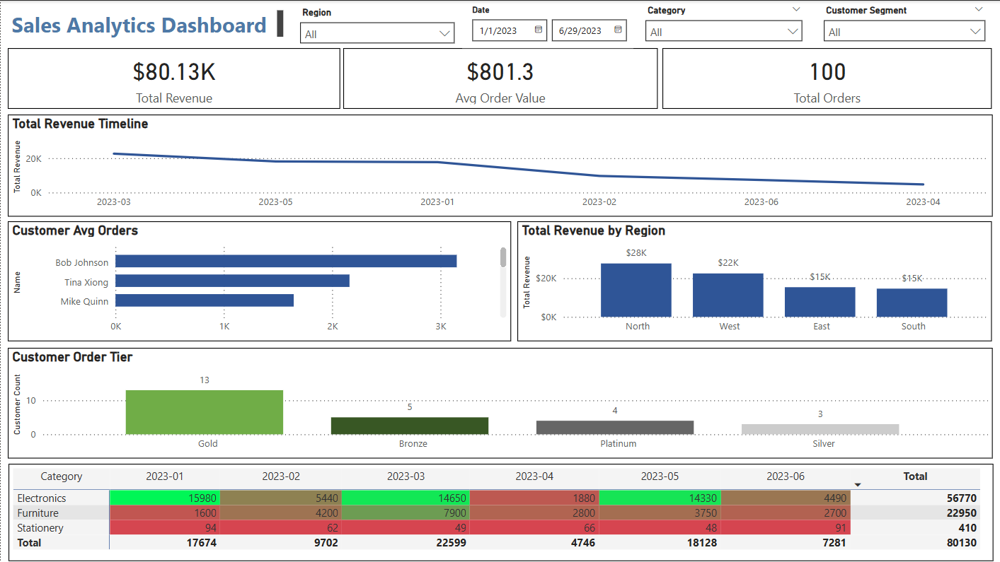
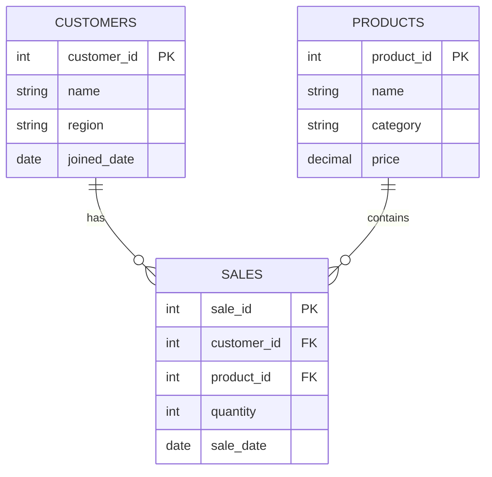

# 📊 Sales Analytics Dashboard


A professional, end-to-end SQL and Power BI analytics project that simulates sales performance reporting for a fictional retail company. This project demonstrates data modeling, SQL querying, KPI creation, and interactive dashboarding—all with clean code and modern visuals.



---

## 🧠 Overview
This project highlights how data professionals can turn raw transactional data into valuable insights using:

- 📦 Star schema design and data seeding with SQL
- 📈 SQL queries for sales trends, customer behavior, and geography insights
- 📊 Power BI dashboard with filters, themes, and metrics
- 💡 Actionable KPIs and professional storytelling visuals

---

## 🗂 Project Structure
```bash
sales-analytics-dashboard/
├── README.md
├── schema/                 # SQL DDL & sample inserts
│   ├── create_tables.sql
│   └── insert_sample_data.sql
├── data/                   # CSVs for use in Power BI
│   ├── customers.csv
│   ├── products.csv
│   └── sales.csv
├── queries/                # SQL business logic
│   ├── monthly_sales.sql
│   ├── top_customers.sql
│   ├── revenue_by_region.sql
│   └── yoy_growth.sql
├── views/                  # Reusable views for reporting
│   ├── v_monthly_kpis.sql
│   └── v_customer_segments.sql
├── dashboards/
│   ├── Sales_Analytics_Dashboard.pbix
│   └── powerbi_mockup.png
├── erd/
│   └── schema.png
└── themes/                 # Custom Power BI styling
    └── advanced_sales_analytics_theme_canvas.json
```

---

## ⚙️ Getting Started
 ### 1. Clone Repo
 ```bash
 git clone https://github.com/yourusername/sales-analytics-dashboard.git
 cd sales-analytics-dashboard
 ```

 ### 2. (Optional) Set Up SQL Engine
 If you'd like to execute SQL logic
   * PostgresSQL
 ```bash
 psql -d your_db -f schema/create_tables.sql
 psql -d your_db -f schema/insert_sample_data.sql
 ```
   * SQLite
 ```bash
 sqlite3 sales.db < schema/create_tables.sql
 sqlite3 sales.db < schema/insert_sample_data.sql
 ```

 ### 3. Load Power BI Dashboard
   * Open: dashboards/Sales_Analytics_Dashboard.pbix

   * Load CSVs from /data

   * Refresh visuals and check relationships:

       * sales.customer_id → customers.customer_id

       * sales.product_id → products.product_id
    
 ### 4. Apply Theme
   * Go to: View → Browse for themes
   * Select: themes/advanced_sales_analytics_theme_canvas.json

---

## 📈 Dashboard Highlights

| Visual                 | Description                                  |
| ---------------------- | -------------------------------------------- |
| 🧮 KPI Cards           | Total Revenue, Avg Order Value, Total Orders |
| 📆 Monthly Trend Chart | Revenue by month                             |
| 🧑‍💼 Top Customers    | Ranked by spend                              |
| 🌍 Revenue by Region   | Map or bar chart by geography                |
| 📋 Category Matrix     | Sales breakdown by product type              |
| 🔲 Customer Segments   | Tiered view (Bronze → Platinum)              |

Includes slicers for:

 * Date range

 * Region

 * Product category

 * Customer tier

---

## 🧩 Entity-Relationship Diagram (ERD)


---

## 🔍 Insights & Takeaways
* 📊 Strongest product categories by region

* 🔁 Seasonality effects on monthly revenue

* 🧑‍💼 Customer concentration in top tiers

* 📉 Year-over-year growth opportunities

---

## 🚀 Future Enhancements
* Export to PDF or email snapshots using Power BI Service

* Add dynamic YoY % change and MoM deltas

* Connect to live data sources (PostgreSQL, Snowflake)

* Create bookmarks and drill-through reports

---

## 🛠 Built With
* SQL (PostgreSQL / SQLite)

* Power BI Desktop

* DAX for calculated KPIs

* Mermaid (ERD rendering)

* GitHub Pages (optional deployment)

---

## 🙋‍♂️ Author
[Derek Acevedo]
[LinkedIn](https://linkedin.com/in/derekacevedo86) · [GitHub](https://github.com/poloman2308)
